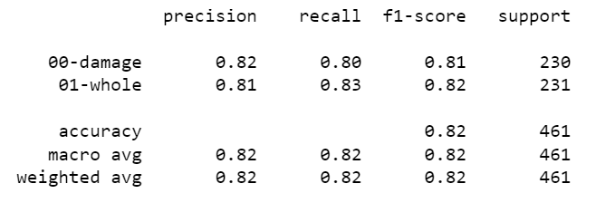

# Capstone Project

## Project Title :
Car Damage Detection System (AutoEyes)

## Team members and their roles :
- Sheikha Alobodi 
- Hanadi Almoutairy 
- Faris Alotibi 
- Abdulmalik Alsharekh

## Introduction :
In today's world, car rental companies face the challenge of efficiently managing their fleets. One of the major problems that they encounter is identifying if a car has been damaged or not, before and after a rental period. This is a crucial task as it helps rental companies to avoid disputes with customers over charges for damages that they did not cause. Currently, car rental companies have to rely on manual inspections to detect damages, which can be time-consuming and error-prone.

To address this challenge, we have developed a computer vision-based system that can automatically detect car damages from images. Our system uses deep learning techniques to analyze images of cars and to identify any visible damages such as dents, scratches, or broken parts. The system can process images taken from different angles and under varying lighting conditions, making it robust and reliable.

Our system has the potential to significantly improve the efficiency of car rental operations by automating the damage detection process. This will not only save time and reduce errors but also improve customer satisfaction by ensuring that they are not charged for damages they did not cause. We believe that our system can be a valuable tool for car rental companies, and we are excited to see its impact on the industry.
## Dataset Overview and Source :

- Images Dataset with Two classes for whole and damage cars.

[Car Damage Dataset Link](https://www.kaggle.com/datasets/anujms/car-damage-detection)

## Proposed Algorithms :
Deep Learning Algorithm (MobileNetV2) uses a Convolutional Neural Network (CNN) architecture model to classify images. It is open-sourced by Google.MobileNetV2 is simplifies the process of image processing. Image processing helps transform the image dataset into a format that the model can understand to give more accurate results.

we use libraries :
- TensorFlow
- Keras
- cv2
- sklearn
- os
- NumPy
- Matplotlib

## Final Results and Conclusion :

The accuracy of the model used for detecting car damages is 82%. This means that the model correctly identifies damages in 82% of the cases. While this is a relatively high accuracy rate, there is still room for improvement, and we are constantly working to refine our model to achieve even better results. With further development and refinement, we believe that our system can become even more accurate and reliable, making it an even more valuable tool for car rental companies.

