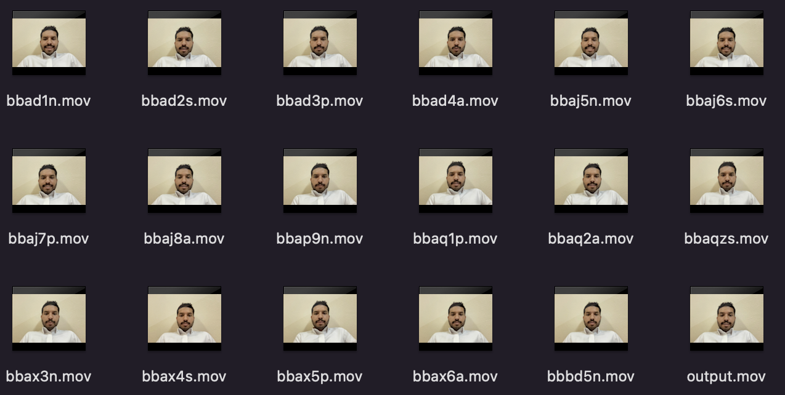
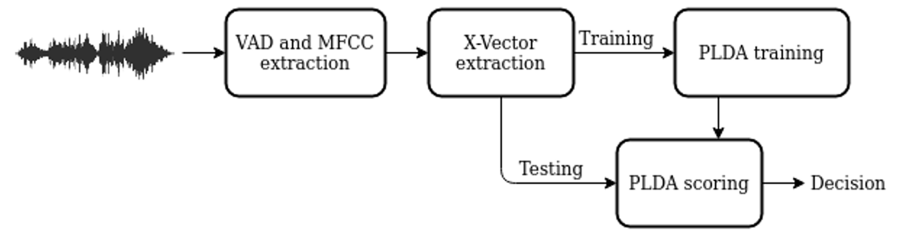
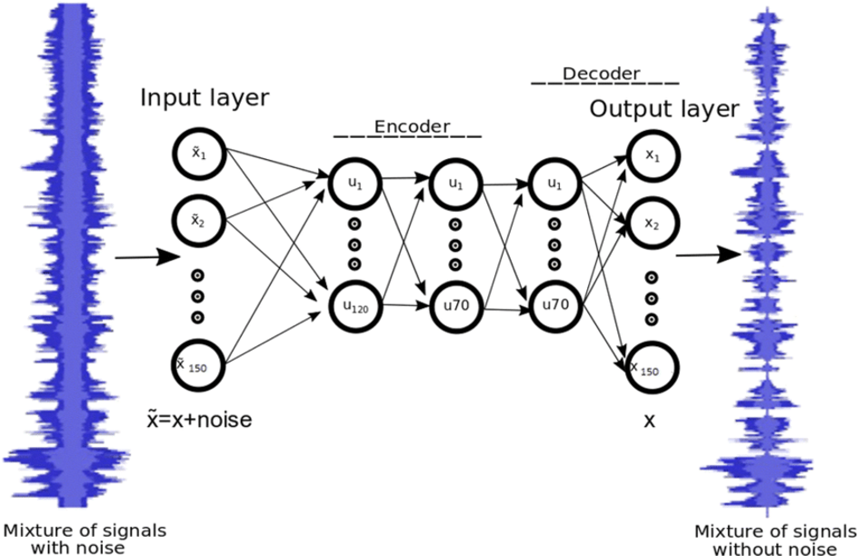
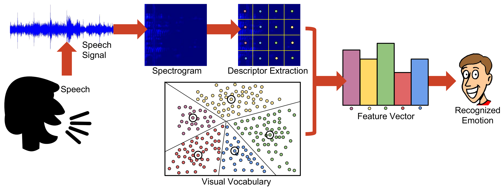
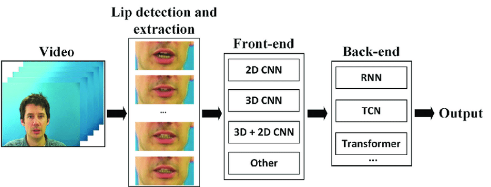

## Team members:
- [Lama Alshabani](https://www.linkedin.com/in/lama-alshabani-78b218230)
- [Omar Alsehli Alkhenani](http://linkedin.com/in/omar-k-alsehli-alkhenani-b037b0213)
- [Majed Alshnifi](https://www.linkedin.com/in/majed-alshnifi/)
- [Omar alnasser](https://www.linkedin.com/in/omaralnasser/)
# Speech Aware

Speech Aware is a project focused on exploring the field of National Security by analyzing voice breakdown. The project incorporates four models to address different aspects related to speech analysis and recognition. These models are speaker recognition, speech enhancement, speech emotion recognition, and lip reading.

## Problem Statement

In the realm of National Security, understanding and interpreting speech plays a crucial role in various scenarios. However, there are several challenges associated with speech analysis, such as speaker recognition, noise interference, emotion recognition, and understanding speech from visual cues. The aim of the Speech Aware project is to develop models that can effectively address these challenges and provide valuable insights for National Security applications.

## Dataset

The Speech Aware project utilizes the following datasets:

1. **Our Self-Recorded Dataset**:
   
   
   - This dataset was recorded specifically for lips reading and speaker recognition tasks.
   - It consists of audio and video recordings of various individuals speaking.
   - The dataset includes corresponding labels for lips reading and speaker identities.

3. **VoxCeleb Dataset**:
   - The VoxCeleb dataset is used for training and evaluation in the speech enhancement model.
   - It is a large-scale dataset containing audio recordings from various celebrities.
   - The dataset provides clean speech signals for training the speech enhancement model.

4. **Video Dataset with Labeled Emotions**:
   - This dataset is employed for training and evaluation in the speech emotion recognition model.
   - It comprises video recordings of individuals expressing different emotions while speaking.
   - The dataset includes labeled emotions corresponding to each video.

## Objectives

The main objectives of the Speech Aware project are as follows:

1. **Speaker Recognition**: The speaker recognition model aims to identify and verify individuals based on their speech characteristics. It utilizes the SpeechBrain toolkit, which incorporates deep learning techniques, such as convolutional neural networks (CNNs) and recurrent neural networks (RNNs), to extract x-vectors. These x-vectors capture speaker-specific information, enabling tasks like enrollment, scoring, and classification for speaker verification or identification.

2. **Speech Enhancement**: The speech enhancement model focuses on improving the quality and intelligibility of speech signals corrupted by noise, reverberation, or other distortions. By leveraging the SpeechBrain toolkit, it employs CNNs and RNNs to train on labeled datasets of noisy and clean speech signals. The trained model can then suppress unwanted background noise in real-time, enhancing the speech signal.

3. **Speech Emotion Recognition**: This model utilizes Convolutional Neural Networks (CNNs) to extract relevant features from spectrograms or other time-frequency representations of the speech signal. Speech emotion recognition aims to analyze speech patterns and identify emotions expressed in the speech. The model can contribute to understanding the emotional content of speech for National Security applications.

4. **Lip Reading**: The lip reading model employs AV-HuBERT, a lip reading model based on the SpeechBrain toolkit. It focuses on understanding speech from visual cues by analyzing lip movements and extracting relevant information. Lip reading can assist in scenarios where audio may be unavailable or compromised, providing an alternative means of speech analysis for National Security purposes.

## Categories for the Four Models

# Speaker Recognition:
   
   
   - Utilizes the SpeechBrain toolkit for speaker recognition tasks.
   - Extracts x-vectors using deep learning techniques like CNNs and RNNs.
   - Provides modules for speaker verification, identification, enrollment, scoring, and classification.

# Speaker Verification Model

This is a speaker recognition model implemented using the SpeechBrain library, specifically designed for the task of speaker verification.

## Model Architecture

The underlying architecture of the pretrained model is ECAPA-TDNN (Extended Connectionist Temporal Classification with Attentive Pooling - Time Delay Neural Network). ECAPA-TDNN is a state-of-the-art model architecture used in speaker recognition tasks.

## Training

The model was initially trained on the VoxCeleb dataset, a large-scale speaker recognition dataset that includes over a million utterances from thousands of speakers. However, to further enhance the model's performance and adapt it to our specific dataset, additional training was conducted using our self-recorded dataset.

The self-recorded dataset includes audio and video recordings of various individuals speaking, along with corresponding labels for lips reading and speaker identities. By incorporating this dataset during training, the model learned to recognize and verify speakers based on their speech characteristics in a more targeted manner.

The training process involved augmenting the VoxCeleb dataset with our self-recorded dataset and fine-tuning the model on the combined data. This allowed the model to capture the unique characteristics of the speakers in our dataset, improving its accuracy and robustness for speaker verification tasks.

## Pretrained Model

The pretrained `spkrec-ecapa-voxceleb` model, loaded from SpeechBrain's repository, serves as a valuable starting point for the speaker verification model. However, the additional training performed on our dataset to ensures that the model has been fine-tuned to better accommodate the specific speaker characteristics captured in our self-recorded dataset.

## Speaker Verification

The `verify_files` function compares two audio files and produces a score that reflects the similarity between the voices in those files. It also produces a prediction of whether the two voices belong to the same speaker, based on a threshold applied to the similarity score. The threshold is determined during the training process, usually on a validation set.

## Output

The model outputs a similarity score (a floating-point number) and a binary prediction (True or False). A higher score indicates a higher likelihood that the two voices belong to the same speaker. The binary prediction is `True` if the model believes the same speaker is present in both files and `False` otherwise.

# Speech Enhancement:

   
   - Implements speech enhancement techniques to improve speech signal quality.
   - Relies on the SpeechBrain toolkit for speech enhancement tasks.
   - Trains CNNs and RNNs on labeled datasets of noisy and clean speech signals.
   - Real-time suppression of background noise during speech enhancement.

# Speaker Enhancement Model

This is a speaker enhancement model implemented using the SpeechBrain library, specifically designed for the task of audio enhancement.

## Model Architecture

The underlying architecture of the pretrained model is SepFormer, a transformer-based model for speech separation. SepFormer is a cutting-edge model architecture used in audio enhancement tasks.
## Training
The model was trained on the WHAMR! dataset, a large-scale speech enhancement dataset that includes a wide range of different noisy audios. The model learns to separate the speaker's voice from the background noise during training, which then allows it to enhance the clarity of speakers in unseen audio data.
The model was trained using a specific loss function optimized for speech enhancement, with noisy audio as inputs and a clean version of the audio as the output. It was trained for several epochs until the performance on a validation set stopped improving.
## Pretrained Model
In this project, we utilize the speechbrain/sepformer-whamr-enhancement model, a pre-trained model that is hosted in the SpeechBrain's repository.
A pre-trained model is a model that was trained on a large benchmark dataset to solve a problem similar to the one that we want to solve. Accordingly, you can use it to bootstrap our own learning process. This model is trained with the WHAMR! dataset, which is a large-scale, multi-speaker, multi-channel, reverberant dataset for speech separation and recognition.
The SepFormer architecture used in this pre-trained model is a state-of-the-art method for speech separation tasks. It is based on the Transformer architecture, which utilizes self-attention mechanisms and has demonstrated remarkable performance in numerous tasks across different domains.
The advantage of using a pre-trained model is twofold:
-	Saves time and resources: Training a model from scratch requires a lot of computational resources (high-end GPUs) and can take a significant amount of time, depending on the architecture of the model and the size of the dataset. By using a pre-trained model, we save a lot of time as we don't have to train the model from scratch.

-	Better performance: Pretrained models are usually trained on large datasets with a wide variety of data. Therefore, they capture a wide range of features and patterns, which helps to improve the performance of the model on different tasks.
For our speaker enhancement model, we load the pre-trained speechbrain/sepformer-whamr-enhancement model from the SpeechBrain repository, which greatly simplifies the enhancement process and saves a significant amount of time and computational resources
.
## Audio Enhancement
The Speaker Inhancment function processes an audio file and produces a separated/enhanced audio. It separates the voice components in the provided audio file and enhances the overall quality.
## Output
The model outputs a clean version of the input audio file with reduced background noise and improved speaker clarity.

# Speech Emotion Recognition Model

   
   - Leverages Convolutional Neural Networks (CNNs) for feature extraction.
   - Analyzes spectrograms or time-frequency representations of speech signals.
   - Identifies emotions expressed in speech for emotional content analysis.

This is a deep learning model for speech emotion recognition using the RAVDESS Emotional Speech Audio Dataset.

## Dependencies

The model requires the following libraries:

- Matplotlib
- Librosa
- OS
- SciPy
- NumPy
- FastAI
- glob
- FetchLabel (a local class you need to define)

The code also uses the `sounddevice` library to record live audio for predictions.

## Process

1. The audio files are loaded using the Librosa library, which is used for music and audio analysis. Each file is converted into a Mel spectrogram, a graphical representation of the spectrum of frequencies of sound as they vary with time.

2. These spectrograms are then converted into decibel units for better audio signal representation.

3. The model extracts features from each audio file, identifies the expressed emotion, and saves the file in a designated folder according to the emotion.

4. A convolutional neural network (CNN) learner from the FastAI library is used to train the model on the spectrogram images. The learner uses a pre-trained ResNet-34 model and is trained for ten epochs.

5. The performance of the model is evaluated using a confusion matrix. The model can also be used to classify live audio recorded via the `sounddevice` library.

# Lip Reading:

   

  

   
   
   - Utilizes AV-HuBERT, a lip reading model based on the SpeechBrain toolkit.
   - Focuses on understanding speech from visual cues, specifically lip movements.
   - Extracts relevant information from lip movements for speech analysis.
     
   

This script is designed to download, process, and classify video data. The algorithm leverages deep learning techniques, specifically temporal convolutional networks (TCNs), to recognize and classify video clips. Here is a detailed step-by-step breakdown of the code.

## Taking an Example Video

The script takes the necessary files for video preprocessing, including a shape predictor, mean face landmarks, and a sample video from an online source. The shape predictor and mean face landmarks are used in conjunction to identify and extract the region of interest (ROI) from each frame of the video - in this case, the mouth of the person speaking.
This process involves detecting facial landmarks, identifying the coordinates of the mouth, and cropping the video to only include the mouth region. This ROI is then passed to the pre-trained model for inference.

## Import a Pre-Trained Model

This section downloads a pre-trained AV-Hubert model checkpoint. AV-Hubert is a model trained on a large amount of audio-visual data, and is capable of inferring spoken words from visual inputs. The model is pre-trained, meaning it has already been trained on a vast amount of data and can be used directly for inference.
The downloaded model is then used to perform inference on the video ROI, generating a hypothesis about the content of the video, specifically predicting the words that are spoken based on the movement of the mouth.

## Inference Process

The inference process begins with the extraction of features from the ROI frames. These features, which capture the visual cues related to speech, are fed into the pre-trained model. The model generates an output hypothesis representing the predicted spoken words.
The script then processes the output hypothesis, splitting the generated sentence into individual words. This process allows for the classification of each word separately in the next steps.

## Positive and Negative Word Lists

This section involves creating lists of "good" and "bad" words. The definitions of "good" and "bad" are context-dependent and should be customized based on the specifics of your application. The lists are used to classify the words produced by the model during the inference process.

## Word Embedding and Clustering

In this step, the sentence transformers library is used to convert the predicted words into vectors in a high-dimensional space. This process is known as word embedding, and it provides a numerical representation of words that captures their semantic meanings.
Next, the dimensionality of the vectors is reduced to two dimensions using UMAP (Uniform Manifold Approximation and Projection). This step makes the data easier to work with and allows for visualization in a two-dimensional space.
Following the dimensionality reduction, K-means clustering is applied to the 2D word embeddings. The K-means algorithm partitions the words into two clusters, representing "good" and "bad" words based on their semantic similarity.

## Logistic Regression

The 2D word embeddings and the labels obtained from the K-means clustering are used to train a logistic regression model. The logistic regression model serves as a classifier that can predict whether a new word is "good" or "bad" based on its 2D embedding.
The logistic regression model is a simple yet effective linear model for binary classification tasks. Once trained, it can be used to predict the classification of unseen words, providing a means of continuous classification as new words are predicted by the AV-Hubert model.

## Visual Feature Extraction

Finally, the script extracts visual features from the video using the pre-trained model. The frames are first normalized and cropped to a standard size before being converted into a tensor, a multi-dimensional array structure favored for machine learning tasks.
The tensorized frames are then passed through the pre-trained model to obtain the final feature vectors. These feature vectors serve as the input to the inference process, allowing the model to generate predictions based on the visual features.

# In conclusion,
the Speech Aware project focuses on exploring the field of National Security by analyzing voice breakdown. The project incorporates four models: speaker recognition, speech enhancement, speech emotion recognition, and lip reading.

The speaker recognition model aims to identify and verify individuals based on their speech characteristics. It utilizes the SpeechBrain toolkit and the ECAPA-TDNN architecture for training and inference. The model is fine-tuned using a combination of the VoxCeleb dataset and a self-recorded dataset, enabling accurate speaker verification and identification.

The speech enhancement model improves the quality and intelligibility of speech signals corrupted by noise, reverberation, or other distortions. It employs the SepFormer architecture, a transformer-based model, trained on the WHAMR! dataset. The model separates the speaker's voice from background noise, enhancing the clarity of speakers in audio recordings.

The speech emotion recognition model utilizes Convolutional Neural Networks (CNNs) to analyze spectrograms or time-frequency representations of speech signals. It identifies emotions expressed in speech, enabling emotional content analysis for National Security applications.

The lip reading model employs AV-HuBERT, a lip reading model based on the SpeechBrain toolkit. It focuses on understanding speech from visual cues by analyzing lip movements and extracting relevant information. Lip reading serves as an alternative means of speech analysis when audio is unavailable or compromised.

Overall, the Speech Aware project addresses various challenges in speech analysis and recognition, providing valuable insights for National Security applications such as speaker identification, speech enhancement, emotion analysis, and lip reading.

