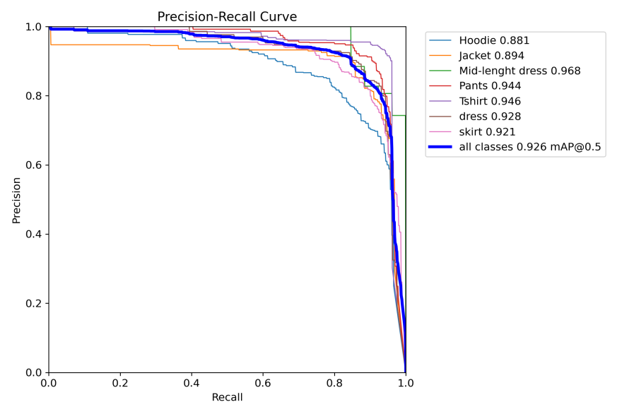
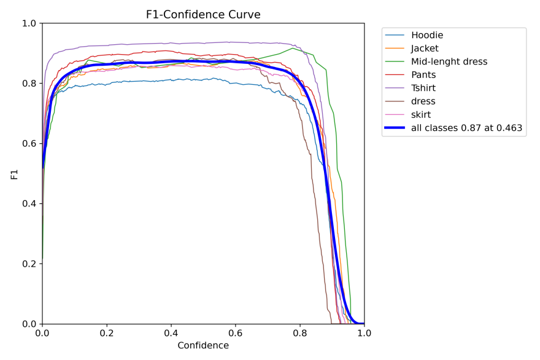
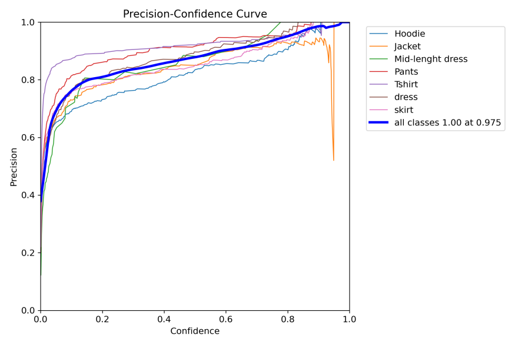
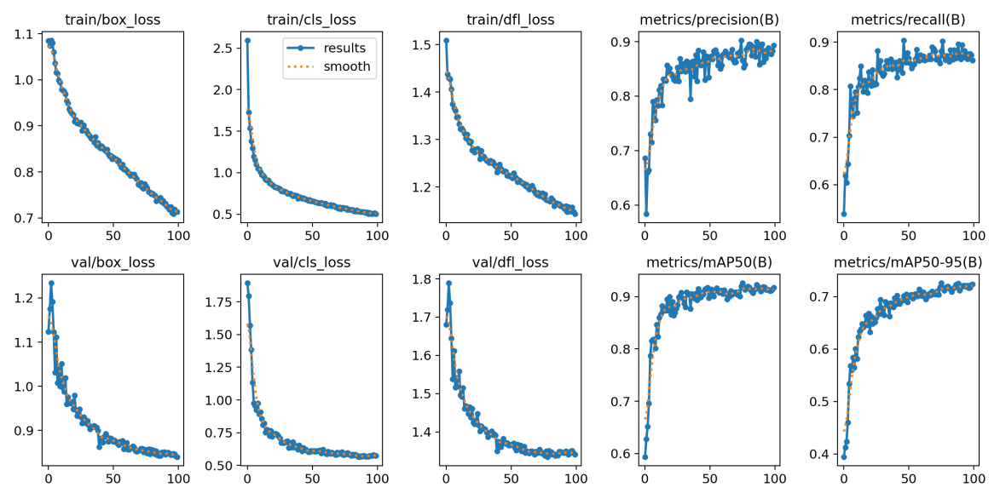

## Names of group members and their roles: 
### 1- Albandari Alshudukhi (Web & Model) 
### 2- Amjad Alsuwaiket (Web & Model)
### 3- Fai Alamri (Web & Model)
### 4- Najlaa Alsowayed (Web & Model)  

# Introduction: 

If you have color blindness, it means you see colors differently than most people. Most of the time, color blindness makes it hard to tell the difference between certain colors. Usually, color blindness runs in families. The main symptoms are The difference between colors, How bright colors are, and Different shades of colors. Symptoms of color blindness are often so mild that you may not notice them. And since we get used to how we see colors, many people with color blindness don’t know they have it. People with very serious cases of color blindness might have other symptoms, too — like quick side-to-side eye movements (nystagmus) or sensitivity to light. There’s no cure, but special glasses and contact lenses can help. On the other hand, not all color blindness people have the budget to buy special glasses and contact lenses to notice the matching colors of their clothes, for example, that's the main reason our model is building.

# Dataset Overview: 
Taking Labeled images of clothes from the Roboflow Website contains 5014 labeled images, and this is the resource: 
https://universe.roboflow.com/dataset-yn4f8/detect-e9mzw/dataset/3

# Proposed Algorithms:
  

At first, we wanted the model we built to be real-time and easy to use, so the first suggestion we applied in Color Correctness Model was implementing Web Camera, then our algorithms started to work! 
Web Camera detects the type of worn clothes such as Recognition Pants, T-shirts, Hoodies, Mid-length skirts, Mid-length dresses, and Jackets, and at the same moment detects the color of worn clothes. The Algorithm used in Color Correctness Model is YOLO, which is a pre-trained deep learning algorithm. It is one of the most effective object detection algorithms that also encompasses many of the most innovative ideas coming out of the computer vision research community. Object detection is a critical capability of autonomous vehicle technology.

# Final result and Conclusion:

The results after creating the Color Correctness Model are successfully detecting of trained clothes (Pants, T-shirts, Hoodies, Mid-length skirts, Mid-length dresses, and Jackets) and detecting the colors of the showing clothes too.

## These graphs below represent the model performance 

### High precision and recall will return very few results, but most of the predictions are correct

 

### F1 detection confidence threshold curve for YOLOv5

### Precision detection confidence threshold curve for YOLOv5

 

### Graph of the Color Correctness Model training results:

#### 1- Train/val box_loss: the bounding box loss of the training dataset or validation dataset; the smaller the box is, the more accurate. 

#### 2- Train/val obj_loss: train or val is speculated to be the mean loss of the target detection, and the smaller the target detection is, the more accurate the detection. 

#### 3- Train/val cls_loss: train or validation is speculated to be the mean of classification loss, and the smaller the classification is, the more accurate. 
 
  

