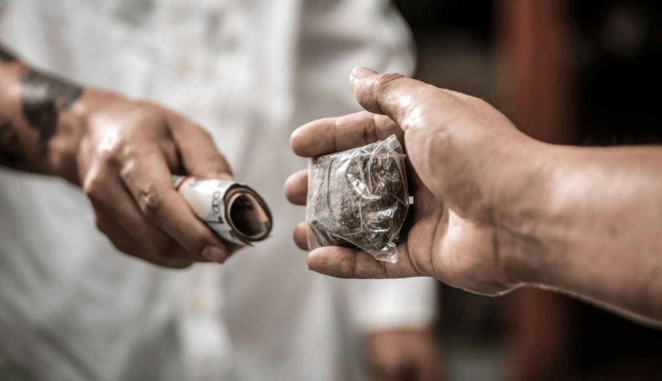

# Bootcamp-Final-Project

# Team Member
- Farah Alosaimi
- Zainab Melaibari
- Hisham Altayieb
- Essa Alhammad

# Drug Detection (ضبط)

Drug dealing is a serious issue that can happen in public places or at security checkpoints, and it's often difficult to detect. To address this problem, we have developed a convolutional neural network (CNN) that can detect suspicious interactions that may involve drug deals. Our model can analyze real-time video footage from security cameras and determine if an interaction contains drugs or not.

# Bussiness Problem 
Provided a deep learning model that performs classification of drug-related images. The objective of the model is to predict whether an image contains drugs or not. The code uses a Convolutional Neural Network (CNN) architecture implemented in TensorFlow/Keras to train and evaluate the model.

# Objective
- Automated Drug Detection: The model will provide an automated solution for detecting drug-related images, enabling quick and efficient identification of drugs in various contexts. This can aid law enforcement agencies, regulatory bodies, and healthcare professionals in identifying drug-related content and taking appropriate actions.

- Enhancing Drug Control Efforts: By accurately classifying drug-related images, the model can contribute to efforts aimed at controlling and preventing drug abuse. It can assist in identifying potential drug trafficking patterns, illicit drug production, and online drug sales, helping authorities prioritize investigations and interventions.

- Time and Cost Savings: Automating the detection process using the developed model can save significant time and resources compared to manual inspection. Instead of relying solely on human efforts to analyze large volumes of images, the model can quickly process and classify images, allowing experts to focus on higher-level tasks and decision-making.

- Scalability and Consistency: The deep learning model can handle large-scale datasets and maintain consistent classification accuracy. It can analyze a vast number of images in a reproducible manner, ensuring reliable results regardless of the dataset size or variations in image characteristics.

- Potential for Adaptability: Once trained, the model can be easily adapted or fine-tuned for specific drug-related classification tasks. It can be extended to handle different drug categories, identify specific drug forms or paraphernalia, or even incorporate real-time image analysis for immediate detection and response.

# Steps
The model was built from scratch using Keras and TensorFlow, and it was trained on a manually collected dataset of images that includes different types of drugs and normal things. We used data augmentation techniques to increase the size of the dataset and improve the model's robustness.

The CNN consists of multiple layers of convolutional and pooling layers, followed by fully connected layers. The output layer uses a sigmoid activation function to predict the probability of the interaction containing drugs. We trained the model using binary cross-entropy loss and optimized it using the Adam optimizer.

Our model achieved high accuracy on the test set and showed promising results on real-world footage. By detecting suspicious interactions, our model can help law enforcement agencies and security personnel to prevent drug dealing and improve public safety. 
This code is to train a CNN model to classify drug-related images and evaluate its performance on a test set. The code performs the following steps:

- Loads the dataset consisting of drug-related images and their corresponding JSON files.
- Preprocesses the images and extracts bounding box information from the JSON files.
- Maps the class labels to numeric values for training.
- Splits the dataset into training, validation, and test sets.
- Defines the CNN model architecture.
- Compiles the model with the appropriate optimizer and loss function.
- Trains the model using the training and validation sets.
- Evaluates the model's performance on the test set.
- Saves the trained model for future use.
- Displays and plots the training and validation accuracy/loss curves.
- Tests the model on real data by loading an image and making predictions.

# Deployment 
We developed a Django web page for seamless user interaction. The web page allows users to upload images and receive predictions from the drug detection model. This integration enhances accessibility and simplifies the process of identifying drug presence in uploaded images.
[Django](https://drive.google.com/drive/folders/1-1lbEMK_uSetDc9yrqv1wzaEdH9yfSa1?usp=sharing)

# Future Work
The project can be further improved and extended in the following ways:

- Multi-class Classification: Extend the model to classify images into multiple drug categories or subtypes. This could involve expanding the dataset with additional classes, enhancing the model architecture, and optimizing training strategies to handle the increased complexity.

- Real-time Deployment: Develop a real-time drug detection system by integrating the trained model with live image streams or surveillance systems. This could enable proactive monitoring and timely intervention in drug-related activities.

- Transfer Learning and Fine-tuning: Explore the use of pre-trained models on large image datasets (such as ImageNet) and fine-tune them for drug-related image classification tasks. This approach can leverage the learned features and accelerate model training while maintaining or improving performance.

- Continuous Model Improvement: Continuously gather new labeled data and retrain the model periodically to adapt to evolving drug-related trends and variations in image characteristics. This iterative process can enhance the model's accuracy and robustness over time.

- Collaboration and Data Sharing: Collaborate with law enforcement agencies, healthcare institutions, and other stakeholders to expand the dataset, share knowledge, and improve the model's performance in real-world scenarios. This can involve collecting diverse image samples, addressing domain-specific challenges, and fostering a community-driven approach to drug detection.

# Conclusion
our drug detection project has successfully developed a CNN model for accurate classification of drug-related images. The model has significant potential in law enforcement, regulatory bodies, and healthcare for quick and efficient drug identification. Future work includes multi-class classification, real-time deployment, and continuous model improvement.
